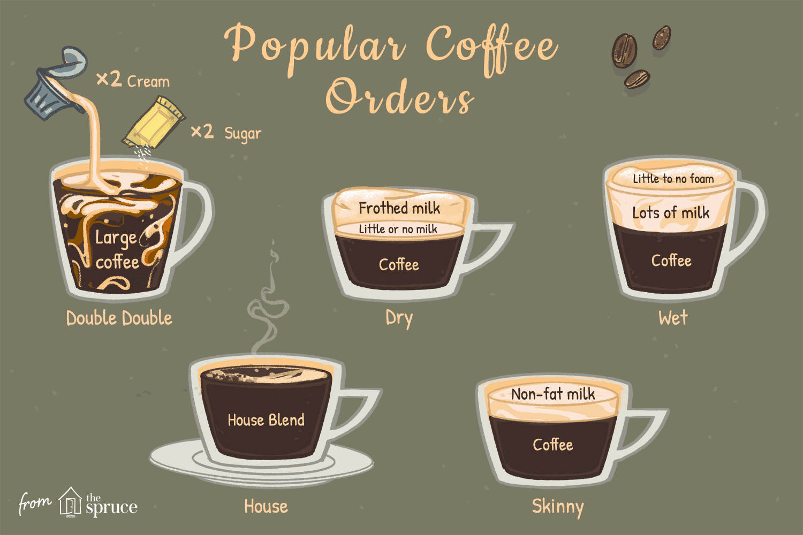
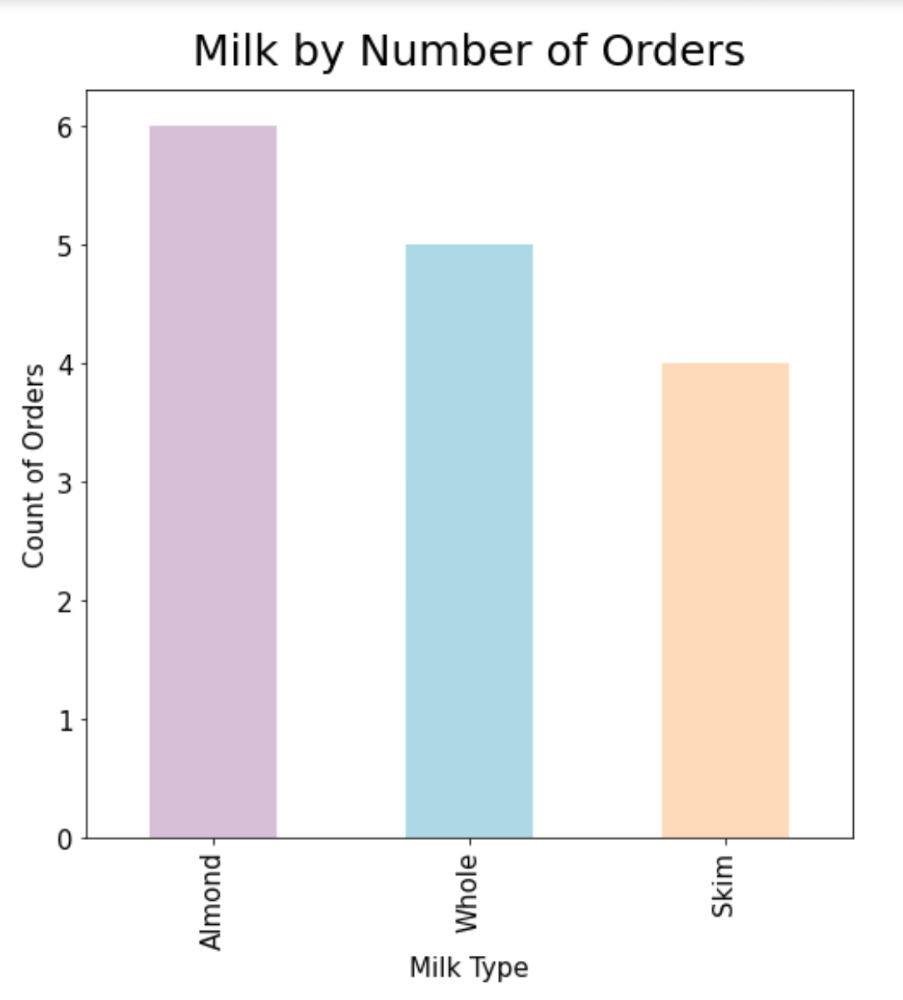
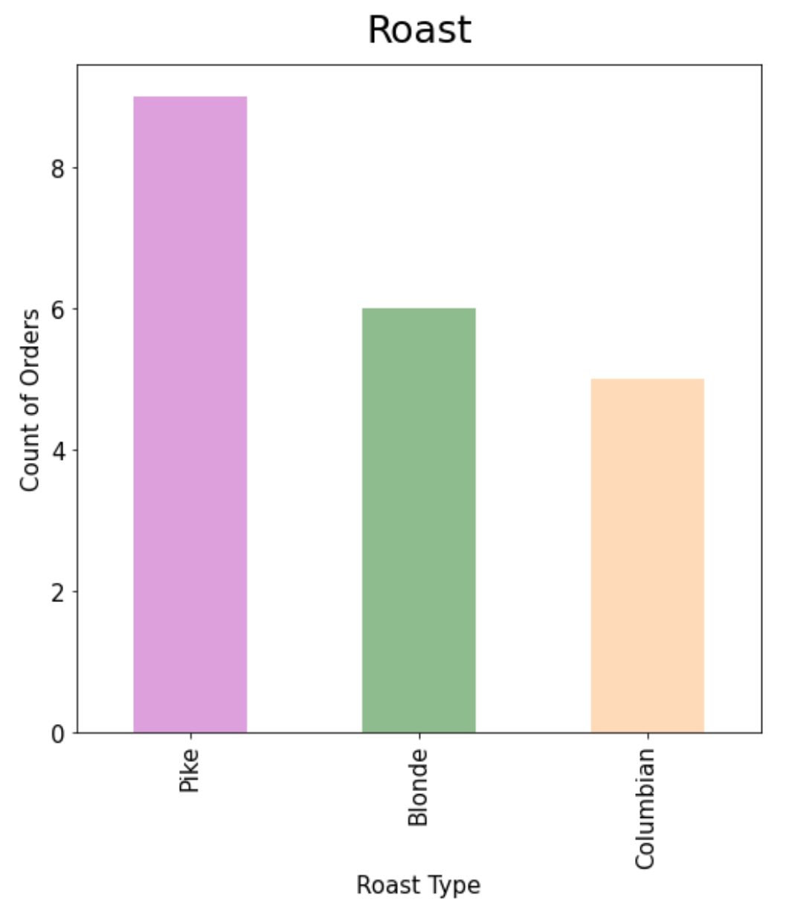
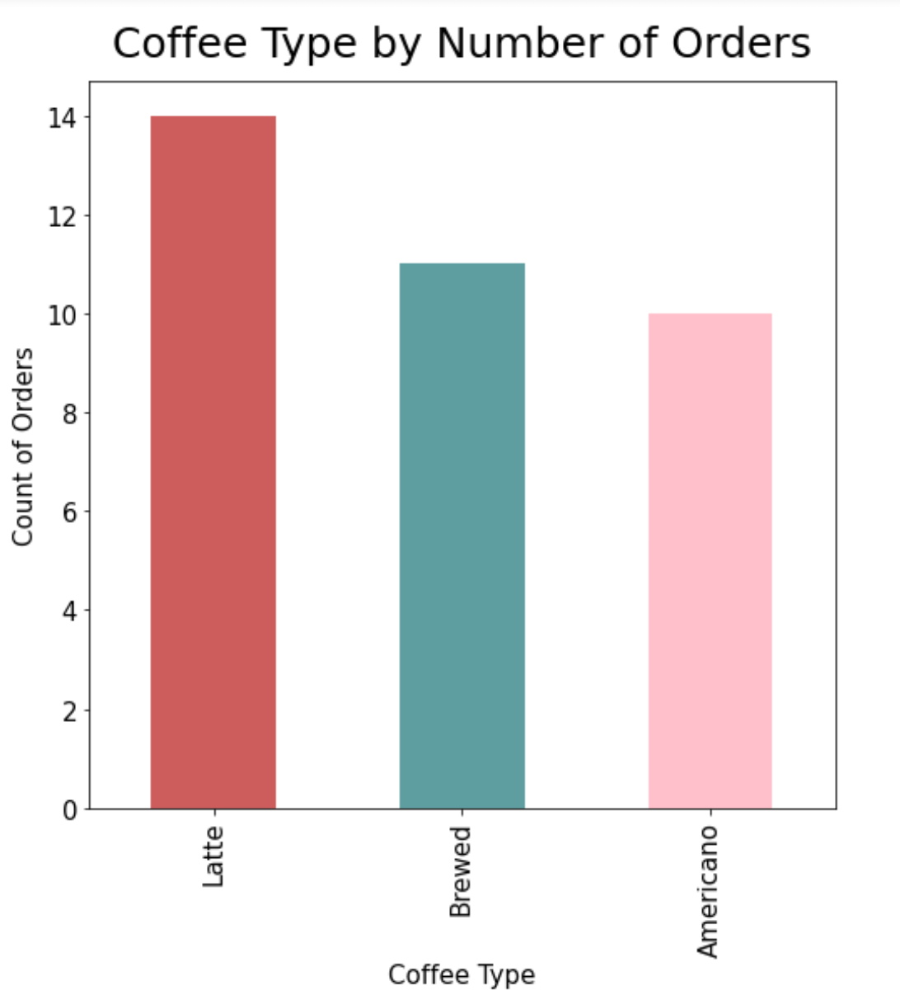

# Coffee Shop Order Management System

This project implements an order management system for a small coffee shop in Seattle. It allows the manager to document orders, analyze sales data, and visualize trends.

## Features

- **Order Documentation**: Record details of each order, including drink type, size, milk option, and roast type.
- **Price Calculation**: Automatically calculate prices based on drink specifications.
- **Data Analysis**: Retrieve information on popular items, total revenue, and largest orders.
- **Data Visualization**: Generate graphs to visualize sales trends.

## Technologies Used

- Python
- Pandas
- SQLite
- Matplotlib

## Data Visualization

The system generates bar graphs to visualize:
- Milk preferences by number of orders
  

- Roast type popularity

- Coffee type preferences

## Project Structure

- `main.py`: Main script containing the user interface and core functionality
- `Coffee_Orders.csv`: CSV file containing sample order data
- `Coffee_Orders.sql`: SQL file for creating and populating the database
- `Coffee_Orders.db`: SQLite database file

## Contributors

- Kairavi Dave
- Ava Feeney
- Jackie Castro
- Veronica Kharunda
